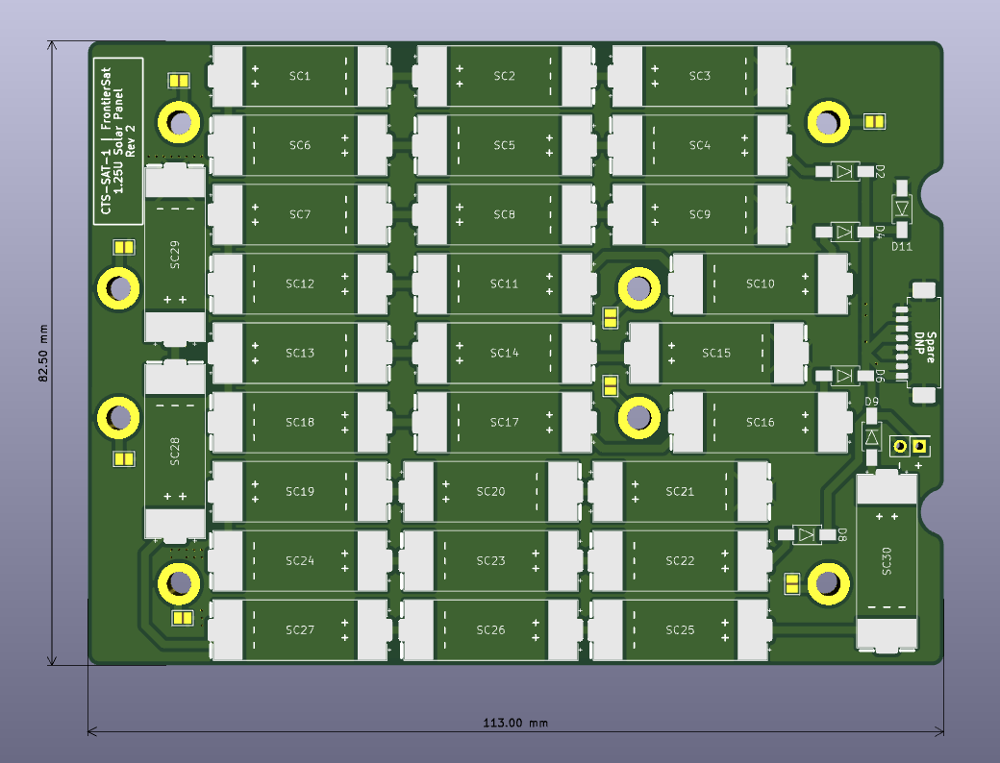

# CTS-SAT-1-Solar-Panels
Solar panel PCB designs for the CTS-SAT-1 3U cubesat

## Overview
* 4x COTS 2U solar panels are the main power generation for the satellite.
* As a proof of concept, the following panels are manufactured in-house:
    * 2x 1.25U panels
    * 1x 1.0U panel
* Each panel has backflow blocking diodes and shadow-protection diodes.

## 1.25U Solar Panel

* 30 cells, in a 6S5P configuration (6 cells in each string, then joined in parallel).

## Bill of Materials
* PMEG10020AELPX diode in a SOD128 package
* [AA-DUCT 902 Silver Epoxy Adhesive](https://atomadhesives.com/aa-duct-902-silver-epoxy-adhesive-electrically-conductive-room-temp-curing-air-dr/)

## Solar Panel Assembly Steps
Work in the Laminar Flow Table with proper ESD protection. Wear gloves. Be careful with fragile cells.

1. Clean solar panel with isopropyl alcohol.
2. Boil some water.
3. Put epoxy in hot water for 10 minutes.
4. Massage epoxy in pouch.
5. Get out the solar cells.
6. Apply some epoxy to solar panel pads.
7. Take a picture of the application for reference on future applications.
8. Use the suction tool to place solar cells on the panels.
9. Apply pressure by placing a PCB on top of the soldered panel, and placing a 300g mass on top.
10. Wait 24h for epoxy to dry.
11. Solder short wires to the nearby pads, ensuring the solder blobs do not stick out the back side.
12. Inspect the work.
13. The assembly is complete. 

## License
This project is licensed under the [CERN OHL v2 Permissive](https://choosealicense.com/licenses/cern-ohl-p-2.0/) license. We appreciate attribution and links back, but you are free to do what you wish with this project.
